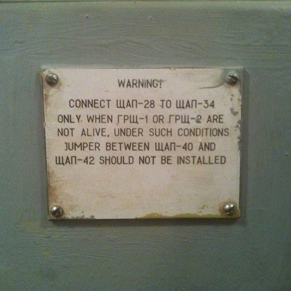

# Camera Module 

Camera Module is a library providing:
 - low-power dual-camera video recording, 
 - still JPEG captures, 
 - media store for archiving videos and snapshots,
 - time-based random length video and still frames extraction from the media store,
 - real-time camera frames captures,
 - custom capture and image processing modules integration,
 - Camera2 API integration. 
                                                   
 
## Run camera module sample app
Download or clone the project from the [git repository](https://github.com/nauto/CameraModule), build and run sample app:
``` bash
   ./gradlew openDebug
```
Click button to start/stop camera service. You'll see notifications (two camera icons) when camera modulue service starts.
Use the Gallery app to check video from cameras added every 30 seconds or click on the list item with a content file name to 
play the video.   

## Add camera module to your app
Edit your project's build.gradle to add this in the "depencies" section:
``` gradle
repositories {
//...
    maven { url "https://raw.githubusercontent.com/nauto/camera-module-lib/master/" }
}

dependencies {
//...
    compile group: 'com.nauto', name: 'camera-module', version: '1.0.12'
}
```

## Create camera services delegate classes

For every camera you have to define a class extending CameraModule. The last character of the class name should be camera id 
as it is reported by the CameraManager:

Back camera:
``` Java
public class Camera0 extends CameraModule {
}
```
Front camera:
``` Java
public class Camera1 extends CameraModule {
}
```

## Add camera services 

Add the folloving to AndroidManifest.xml
``` xml
  <service android:process="nauto.camera.module" android:name=".Camera0"/>
  <service android:process="nauto.camera.module" android:name=".Camera1"/>
```

##  Start / stop camera module

To start/stop all cameras:
``` java
  App app = getApplication();
  // Start all cameras
  CameraModule.startAll(app);
  ...
  // Stop all cameras
  CameraModule.stopAll(app); 
```
To start a single camera:
``` java
  // Start camera 0 with default parameters
  CameraModule.start(app, Camera0.class)
  // Start camera 1 to record 60 sec chunks of 1080p video at 30 fps and 5 Mbit:
  CameraModule.start(app, Camera1.class, "videoLength=60&videoWidth=1920&videoHeight=1080fps=30&bitRate=5000000")
  ```
The video length parameter defines interval in seconds at which camera shedules video file cut off. 
  
Camera Module pipeline parameters:
  ``` java
   /**
   * CameraModule start parameters
   */
    public static final String PARAM_DO_FACE_DETECTION = "doFaceDetection";
    public static final String PARAM_RUN_STICKY = "runSticky";
    public static final String PARAM_BIT_RATE = "bitRate";
    public static final String PARAM_FPS = "fps";
    public static final String PARAM_VIDEO_LENGTH_SEC = "videoLength";
    public static final String PARAM_RECORD_AUDIO = "mRecordAudio";
    public static final String PARAM_VIDEO_WIDTH = "videoWidth";
    public static final String PARAM_VIDEO_HEIGHT = "videoHeight";
    public static final String PARAM_PLAY_SOUND = "playSound";
    public static final String PARAM_CUT_OFF_TIME = "t";
    public static final String SNAPSHOT_COMMAND = "snapshot";
    public static final String PARAM_SNAPSHOT_FILE_NAME = "snapshotFileName";
```

##  Check if camera service is running 
``` java
    boolean isRunnig = CameraModule.isServiceRunning(app, Camera0.class);
    boolean isAnyCameraRunning = CameraModule.isAnyRunning(app);   
```    

##  Cut off video 
To shedule video cut off at a particular time:
``` java
   // Schedule camera 0 to start a new recording in 5 sec. 
   CameraModule.scheduleCutOff(app, "0", 5000);
   ...
      // Schedule all camerasto start a new recording in 5 sec. 
   CameraModule.scheduleCutOff(app, null, 5000);
```

Note: you have to listen for the CameraModule broadcasts to be notified about the video file creation.

See CameraModule source for the refference:
``` java
/**
  * Schedule video cut off.
  *
  * @param ctx
  * @param cameraId null to cut video on all cameras
  * @param timeMs time in milliseconds when to start cut off
  */
 public static void scheduleCutOff(Context ctx, @Nullable String cameraId, long timeMs) 
 
 ```

##  Still captures
To do a snpshot provide a file name or null to create a file in the default Camera Store location.
``` java
    // Capture camera 0 to a file
    CameraModule.snapshot(app, "0", "/sdcard/camera-0.jpeg");
    ...
    // Capture all camera to a camera store
    CameraModule.snapshot(app, "0", "/sdcard/camera-0.jpeg");
```
Note: you have to listen for the CameraModule broadcasts to be notified about the JPEG file creation.

## Listen for CameraModule broadcasts: messages, errors and notifications
``` java
  // Do not forget to unregister receiver!
  getApplication().registerReceiver(mServiceListener = new BroadcastReceiver() {
      @Override
      public void onReceive(Context context, Intent intent) {
          String id = intent.getStringExtra(CameraModule.EXTRA_ID);
          String msg = intent.getStringExtra(CameraModule.EXTRA_MESSAGE);
          int err = intent.getIntExtra(CameraModule.EXTRA_ERROR_CODE, -1);
          // See CameraModule error codes
          if (err != -1) {
              s = "Camera Error " + err + "! id:" + id + ", message: " + msg;
          }
          int notice = intent.getIntExtra(CameraModule.EXTRA_NOTICE_CODE, -1);
          ...
      }
  }, CameraModule.getIntentFilter(getApplication()));
  ```
CameraModule errors and notifications codes:
  ``` java
    /**
     * CameraModule error codes
     */
    public static final int CAMERA_ACCESS_EXCEPTION = 0;
    public static final int CAMERA_PERMISSION_NOT_GRANTED = 1;
    public static final int CAMERA_ERROR = 2;
    public static final int CAMERA_STATE_ERROR = 3;
    public static final int CAPTURE_SESSION_CONFIGURE_FAILED = 4;
    public static final int CAPTURE_SESSION_CONFIGURE_EXCEPTION = 5;
    public static final int SERVICE_START_ERROR = 6;
    public static final int MEDIA_STORAGE_ERROR = 7;
    public static final int CAMERA_DISCONNECTED = 8;
    public static final int MEDIA_RECORDER_ERROR = 9;
    public static final int START_RECORDING_EXCEPTION = 10;
    public static final int ERROR_SYSTEM_CAMERA_SERVICE = 11;
    public static final int CAPTURE_MODULE_ERROR = 12;
    /**
     * CameraModule notice codes
     */
    public static final int SCHEDULED_CUT_OFF_COMPLETED = 0;
    public static final int SCHEDULED_CAPTURE_COMPLETED = 1;    
```
## Camera Store video extraction
You can think about CameraStore video repository as a singe large video from which you can extract a video at any particular time range. 
``` java
   // Extract 5 sec video at 15 sec before now  
   long startTimeMs = new Date().getTime() - 15000;
   long endTimeMs = startTime  - 5000;
   String path = new File('/sdcard/my-video.mp4').getAbsolutePath();
   try {
      CameraStore.extractVideoAsFile(app, "0", startTimeMs, endTimeMs, path);
   } catch (IOException ex){
      ...
   }   
```
##  Snapshot extraction
To get a still capture from camera 0 at a particular time:
``` java
    Bitmap bmp = CameraStore.extractSnaphotAsBitmap(app, "0", timeMs);
```
##  Querying Camera Store
You can query CameraStore to retrieve a list of video chunks available for a particular time range:
``` java
   List<String> videos = new LinkedList();
   CameraStore.getVideosListInTimeRange(app, "0", videos, startMs, endMs);
```
*Note: all calls to CameraStrore are synchroneous. You can allocate as many thread as needed to access CameraStore.*

## Create Capture Module

You can attach multiple capture modules to a particular camera pipeline. For each capture module define a class extending CaptureModule and provide implementation of the onCaptured method:
``` java
public class DriverDistractionModule extends CaptureModule {
    @Override
    public void onCaptured(@NonNull byte[] frame) {
        if (DEBUG) Log.d(TAG, "onCaptured()");
        // TODO:
        ... provide your implementation here
    } 
}
```
Add module declaration to your app's AndroidManifest.xml:
``` xml
  <service android:name=".DriverDistractionModule">
       <meta-data android:name="camera_id" android:value="1" />
       <meta-data android:name="format" android:value="NV21" />
       <meta-data android:name="size" android:value="1280x720" />
       <meta-data android:name="crop_rect" android:value="640,0,1280,720" />
       <meta-data android:name="fps" android:value="3" />
  </service>
```

## Camera Pipeline Config

You can customize the camera mdule pipeline by prividing parameters controlling video and still capture size, video duration, framerate, bitrate, auto exposure mettering rectangle, face detection, sound mode and service run mode.

There are three ways to provide parameters:

1. AndroidManifest.xml

    ```xml
         <service android:name=".camera.Camera0" android:singleUser="true">
            <meta-data android:name="videoSize" android:value="1280,720" />
            <meta-data android:name="fps" android:value="15" />
            <meta-data android:name="bitRate" android:value="2500000" />
            <meta-data android:name="videoLength" android:value="300" />
            <meta-data android:name="doFaceDetection" android:value="false" />
            <meta-data android:name="recordAudio" android:value="false" />
            <meta-data android:name="aeRect" android:value="0,0,1920,1080" />
            <meta-data android:name="jpegSize" android:value="1280,720" />
            <meta-data android:name="runSticky" android:value="true" />
            <meta-data android:name="playSound" android:value="true" />
        </service>
    ```
2. CameraModule subclass:
  
    ```java
    public class Camera0 extends CameraModule {
        @Override
        protected CameraPipelineConfig getCameraPipelineConfig() {
            CameraPipelineConfig cfg = super.getCameraPipelineConfig();
            // override default auto exposure mettering rectangle
            cfg.mAeRects = new int[]{0, 0, 200, 200};
            // override defaulf frame rate
            cfg.mVideoFrameRate = 10;
            return cfg;
        }
     }
    ```
3. Camera Module start command:
 
    ```java
     CameraModule.start(context, "doFaceDetection=0&runSticky=1&bitRate=8000000&fps=30&videoLength=300");
    ```
 
 See all CameraModule parameters keys [here](https://github.com/nauto/CameraModule/blob/master/cameramodule/src/main/java/nauto/com/cameramodule/base/CameraModule.java#L71-L91)
 ```java
     /**
     * Start parameters
     */
    public static final String PARAM_DO_FACE_DETECTION = "doFaceDetection";
    public static final String PARAM_RUN_STICKY = "runSticky";
    public static final String PARAM_BIT_RATE = "bitRate";
    public static final String PARAM_FPS = "fps";
    public static final String PARAM_VIDEO_LENGTH_SEC = "videoLength";
    public static final String PARAM_RECORD_AUDIO = "recordAudio";
    public static final String PARAM_VIDEO_WIDTH = "videoWidth";
    public static final String PARAM_VIDEO_HEIGHT = "videoHeight";
    public static final String PARAM_PLAY_SOUND = "playSound";
    public static final String PARAM_AE_RECT = "aeRect";
    public static final String PARAM_VIDEO_SIZE = "videoSize";
    public static final String PARAM_JPEG_SIZE = "jpegSize";
    public static final String PARAM_CUT_OFF_TIME = "t";
    public static final String SNAPSHOT_COMMAND = "snapshot";
    public static final String PARAM_SNAPSHOT_FILE_NAME = "snapshotFileName";
    public static final String PARAM_SNAPSHOT_SEQUENCE_LENGTH = "snapshotSequenceLength";
    public static final String PARAM_SNAPSHOT_SEQUENCE_INDEX = "snapshotSequenceIndex";
    public static final String PARAM_SNAPSHOT_TRIP_START_TIME = "snapshotTripStartTime";
 ```
